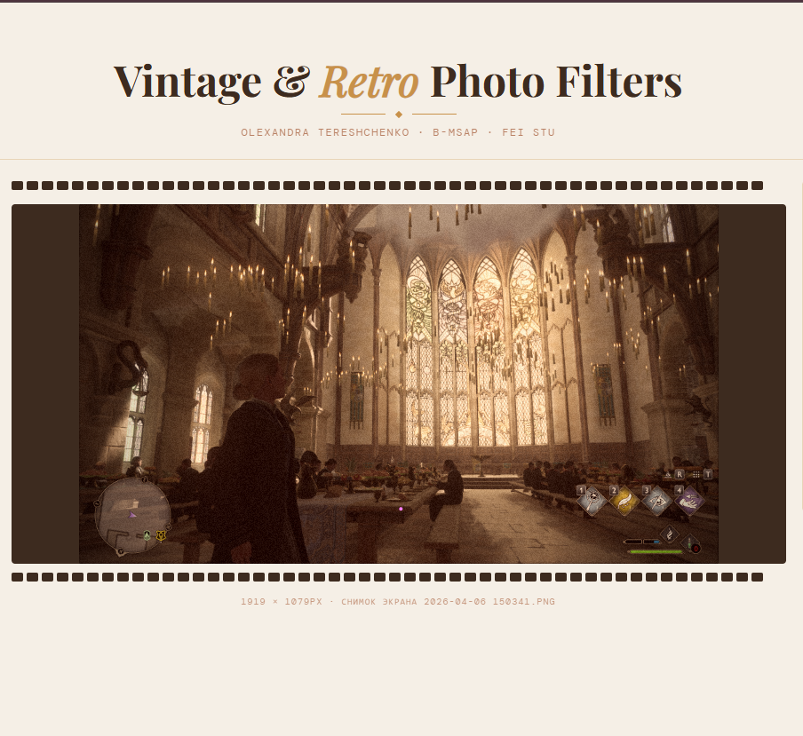

# 🎞️ Vintage / Retro Photo Filter App

**B-MSAP Semestrálna Práca · FEI STU Bratislava**  
**Autor:** Tereshchenko Olexandra

---

## 📌 Popis projektu

Webová aplikácia umožňujúca aplikovanie vintage a retro fotografických filtrov na ľubovoľný obrázok priamo v prehliadači. Bez inštalácie, bez servera — všetko beží lokálne v HTML + JavaScript.

---

## ✨ Funkcie

- 📷 **Nahranie fotografie** — drag & drop alebo výber zo súborov
- 🎨 **9 retro filtrov** — Sepia, Vintage, Polaroid, Noir, Faded, Warm, Kodak, Lomo, Original
- 🎚️ **Nastavenie intenzity** — posuvník pre silu filtra
- 🌾 **Grain efekt** — filmové zrno
- 🔲 **Vignette efekt** — tmavé okraje fotografie
- 💾 **Stiahnutie výsledku** — export ako JPG

---

## 🛠️ Technológie

| Technológia | Použitie |
|---|---|
| HTML5 | Štruktúra stránky |
| CSS3 | Dizajn a animácie |
| JavaScript | Spracovanie obrazu cez Canvas API |
| Canvas API | Pixel-level manipulácia s obrázkom |

---

## 🚀 Spustenie

1. Stiahni repozitár
2. Otvor súbor `index.html` v prehliadači
3. Hotovo — žiadna inštalácia nie je potrebná

---

## 📸 Ukážka

---

## 🎓 Kurz

**B-MSAP** — Multimediálne systémy a aplikácie  
Katedra telekomunikácií, FEI STU Bratislava  
Akademický rok 2025/2026
